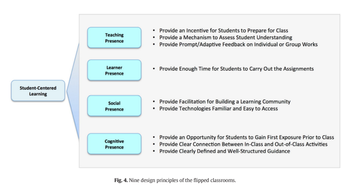

# Kim et al. 2014 continued

#flipped-learning #online-learning #rcoi #course-design 

First note: [[20200709133057]] Kim et al 2014

>Kim, M. K., Kim, S. M., Khera, O., & Getman, J. (2014). The experience of three flipped classrooms in an urban university: An exploration of design principles. _Internet and Higher Education_, 22, 37–50. https://doi.org/10.1016/j.iheduc.2014.04.003

+ Revised Community of Inquiry (RCOI): Four elements contribute to successful learning environment: 
    + Cognitive presence: Knowledge building involving critical and creative thinking 
    + Social presence: Encouraging collegial settings 
    + Teaching presence: Instructional orchestration appropriate to the learning environments
    + Learner presence: self- and co-regulation of learning  
+ Cognitive presence is at the center – had the strongest correlations with the other aspects of RCOI 
+ Six design principles emerge from the case study of three flipped environments: 
    + Provide opportunity for students to gain first exposure prior to class (Yes, but isn't this part of the very definition of FL?) – goes on to say that multiple avenues and some student agency in determining _how_ they get that exposure is important 
    + Provide incentive for students to prepare for class – this appears to mean "don't just make students watch videos" but also provide a clear contextual link between pre- and in-class via assignments
    + Provide a mechanism to assess student understanding – This means both pre- and in-class; low-stakes formative assessment and active learning tasks that provide feedback and data on attainment 
    + Provide clear connections between in-class and out-of-class activities – Not only should learning activities be externally aligned with the learning objectives, they need to be **internally aligned** with each other, with out of class activities aligned with in class activities (especially important for my staggered hybrid courses) 
    + Provide clearly defined and well-structured guidance – Means clarity of instructions and a transparent structure – specific goals, clearly stated learning objectives, clear rubrics and assignment specifications
    + Provide facilitation for building a learning community – connecting students and helping them to collaborate well. The _connecting students_ part is easy – I can form and manage groups – getting them to collaborate well is harder because this is mostly up to the students, though the instructor can make this harder or easier 
    + Provide prompt/adaptive feedback on individual and group work – paper says "or" but I think "and" is right – when students don't get feedback on something, it's hard to see it as helpful or as a learning activity. 
    + Provide technologies familiar and easy to access – and I'd add "and not too many of them" because the point here is to use tools but avoid overload 

+ The paper also has "Provide enough time for students to carry out the assignments" which doesn't show up in the list of things above, but is very important – keep a close eye on the workload (and as part of the structure, give a detailed pie chart style breakdown of time commitments)

